# Firestore schema — `ardent-mds`

Documentation of Cloud Firestore collections and inferred document shapes for the **ardent-mds** Firebase project. Generated from a live database scan (June 2026).

> Firestore is schemaless. Field types below are **inferred from sampled documents** (typically 1–5 per collection), not enforced by the database. Optional or sparse fields may be missing on some documents.

## Project overview

| Item | Value |
|------|--------|
| Firebase project ID | `ardent-mds` |
| Database | `(default)` |
| Edition | Firestore Native, **Standard** |
| Firebase Data Connect | None deployed |
| Apps | Android, iOS, Web (`com.ardentmds.plus`) |

### Security rules

```txt
rules_version = '2';
service cloud.firestore {
  match /databases/{database}/documents {
    match /{document=**} {
      allow read, write: if request.auth != null && request.auth.uid != null;
    }
  }
}
```

All authenticated users with a valid `uid` can read and write any document. Tighten rules before production admin tooling if needed.

### Composite indexes

| Collection group | Fields |
|------------------|--------|
| `attempts` | `status` ASC, `score` DESC, `timeTakenSeconds` ASC |
| `grand_tests` | `testExpiry` ASC, `isActive` ASC, `isLeaderboardPublished` ASC |
| `grand_tests` | `testExpiry` ASC, `isLeaderboardPublished` ASC |
| `payments` | `status` ASC, `createdAt` ASC |

---

## Collection hierarchy

Root-level collections and nested paths that contain real data (empty subcollection stubs under unrelated parents are omitted).

```text
ardent-mds (default)
├── users/{uid}
│   ├── user_payments/{paymentId}
│   └── video_progress/{subjectId}
│       └── lessons/{lessonId}
├── videos/{subjectId}
│   └── lessons/{lessonId}
├── qbanks/{subjectId}
│   └── chapters/{chapterId}
│       └── questions/{questionId}
├── grand_tests/{testId}
│   ├── questions/{questionId}
│   ├── attempts/{userId}
│   └── leaderboard/{userId}
├── 3_min_challenges/{weekKey}
│   ├── daily_questions/{dateKey}
│   │   ├── questions/{questionId}
│   │   └── attempts/{userId}
│   └── leaderboard/{docId}          # e.g. top_three
├── mcq_of_the_day/
│   ├── todays_question                # single document
│   └── previous_questions/
│       └── questions/{questionId}
├── clinical_vignettes/
│   ├── current_question               # single document
│   └── previous_questions/
│       └── questions/{questionId}
├── 10_mins_concept/{docId}
├── suggested_videos/{docId}
├── plans/{planId}
├── payments/{paymentId}
├── banners/{bannerId}
├── states/{stateId}
├── colleges/{stateCode}               # doc ID = state code, e.g. AP
├── faculties/{facultyId}
└── user_queries/{queryId}
```

### Mermaid overview

```mermaid
flowchart TB
  subgraph root [Root collections]
    users
    videos
    qbanks
    grand_tests
    plans
    payments
    banners
    states
    colleges
    faculties
    three_min[3_min_challenges]
    mcq[mcq_of_the_day]
    vignettes[clinical_vignettes]
    ten_min[10_mins_concept]
    suggested[suggested_videos]
    queries[user_queries]
  end

  users --> user_payments
  users --> video_progress
  video_progress --> lessons_vp[lessons]

  videos --> lessons_vid[lessons]

  qbanks --> chapters
  chapters --> questions_q[questions]

  grand_tests --> gt_questions[questions]
  grand_tests --> gt_attempts[attempts]
  grand_tests --> gt_leaderboard[leaderboard]

  three_min --> daily_questions
  three_min --> leaderboard_wk[leaderboard]
  daily_questions --> questions_dq[questions]
  daily_questions --> attempts_dq[attempts]

  mcq --> todays[todays_question doc]
  mcq --> previous[previous_questions doc]
  previous --> questions_mcq[questions]
```



---

## Root collections

### `users`

Student profiles. Document ID is typically the Firebase Auth `uid`.

| Field | Type | Notes |
|-------|------|--------|
| `uid` | string | Firebase Auth UID |
| `email` | string | |
| `phone` | string \| null | |
| `name` | string \| null | |
| `profileImagePath` | string \| unknown | |
| `isActiveUser` | boolean | |
| `isEmailVerified` | boolean | |
| `isPhoneVerified` | boolean | |
| `isOnboardCompleted` | boolean | |
| `authenticationMethod` | string | e.g. email, phone |
| `state` | mixed | |
| `deviceId` | string \| null | |
| `deviceLimit` | number | |
| `fcmToken` | string \| null | |
| `progress` | map | See below |
| `mcqProgress` | map | See below |
| `academicDetails` | map | See below |
| `plans` | map | Active plan snapshot |
| `dailyVignettes` | map | Vignette attempt state |
| `studentQuestionnaire` | map | Onboarding answers |

**`progress`**

| Field | Type |
|-------|------|
| `streakCount` | number |
| `totalTimeSpent` | number |
| `videosCompleted` | number |
| `quizzesCompleted` | number |
| `testsCompleted` | number |
| `avgScore` | number |

**`mcqProgress`**

| Field | Type |
|-------|------|
| `streakCount` | number |
| `userOption` | number |
| `lastAttempted` | mixed |

**`academicDetails`**

| Field | Type |
|-------|------|
| `collegeState` | string |
| `collegeName` | string |
| `academicYear` | string |

**`plans`** (embedded on user)

| Field | Type |
|-------|------|
| `planId` | string |
| `planName` | string |
| `planModules` | mixed |
| `planPurchaseDate` | mixed |
| `planExpiryDate` | mixed |
| `purchaseId` | mixed |

**`dailyVignettes`**

| Field | Type |
|-------|------|
| `id` | string |
| `lastAttempted` | mixed |
| `selectionOption` | mixed |

**`studentQuestionnaire`**

| Field | Type |
|-------|------|
| `isCollegeStudent` | string |
| `isEnrolledArdentStudent` | string |

---

### `videos`

Video subjects / courses.

| Field | Type |
|-------|------|
| `id` | string |
| `subjectName` | string |
| `description` | string |
| `imageUrl` | string |
| `icon` | string |
| `mvid` | number |
| `totalLessons` | number |
| `totalModules` | number |
| `sortOrder` | number |
| `isActive` | boolean |
| `studentsCompleted` | number |
| `studentsProgressing` | number |
| `createdAt` | timestamp |
| `updatedAt` | timestamp |

#### Subcollection: `videos/{subjectId}/lessons/{lessonId}`

| Field | Type |
|-------|------|
| `id` | string |
| `lessonName` | string |
| `moduleName` | string |
| `description` | string |
| `thumbnailImage` | string |
| `duration` | number |
| `muxAssetId` | string |
| `muxPlaybackId` | string |
| `timelines` | array |
| `facultyId` | string |
| `sortOrder` | number |
| `rating` | number |
| `isActive` | boolean |
| `isFree` | boolean |
| `studentsCompleted` | number |
| `studentsProgressing` | number |
| `createdAt` | timestamp |
| `updatedAt` | timestamp |

---

### `qbanks`

MCQ question-bank subjects.

| Field | Type |
|-------|------|
| `id` | string |
| `subjectName` | string |
| `description` | string |
| `facultyId` | string |
| `imageUrl` | string |
| `icon` | string |
| `chaptersCount` | number |
| `mcqMid` | number |
| `sortOrder` | number |
| `isActive` | boolean |
| `studentsCompleted` | number |
| `studentsProgressing` | number |
| `createdAt` | timestamp |
| `updatedAt` | timestamp |

#### Subcollection: `qbanks/{subjectId}/chapters/{chapterId}`

| Field | Type |
|-------|------|
| `id` | string |
| `chapterName` | string |
| `subjectName` | string |
| `moduleName` | string |
| `description` | string |
| `imageUrl` | string |
| `mcqSmChildId` | string |
| `questionsCount` | number |
| `microtopics` | array |
| `rating` | number |
| `sortOrder` | number |
| `isActive` | boolean |
| `isFree` | boolean |
| `studentsCompleted` | number |
| `studentsProgressing` | number |
| `createdAt` | timestamp |
| `updatedAt` | timestamp |

##### Subcollection: `qbanks/{subjectId}/chapters/{chapterId}/questions/{questionId}`

Uses the shared [MCQ question shape](#shared-mcq-question-shape).

---

### `grand_tests`

Scheduled mock / grand tests.

| Field | Type |
|-------|------|
| `id` | string |
| `title` | string |
| `testStart` | timestamp |
| `testExpiry` | timestamp |
| `duration` | number |
| `questions` | number |
| `correctMark` | number |
| `negativeMark` | number |
| `isFree` | boolean |
| `isActive` | boolean |
| `isLeaderboardPublished` | boolean |
| `totalParticipants` | number |
| `leaderboardScheduleTaskId` | string |
| `createdAt` | timestamp |

#### Subcollection: `grand_tests/{testId}/questions/{questionId}`

Simplified question payload (embedded options, not full qbanks shape).

| Field | Type |
|-------|------|
| `id` | string |
| `order` | number |
| `question` | string |
| `questionImage` | null \| string |
| `subject` | string |
| `options` | array |
| `correctOption` | map: `option` (number), `description` (string), `image` (array) |

#### Subcollection: `grand_tests/{testId}/attempts/{userId}`

Document ID = user ID.

| Field | Type |
|-------|------|
| `userId` | string |
| `status` | string |
| `score` | number |
| `correctCount` | number |
| `incorrectCount` | number |
| `skippedCount` | number |
| `timeTakenSecs` | number |
| `answers` | array |
| `startedAt` | timestamp |
| `submittedAt` | timestamp |

#### Subcollection: `grand_tests/{testId}/leaderboard/{userId}`

| Field | Type |
|-------|------|
| `userId` | string |
| `name` | string |
| `profileImageUrl` | string |
| `rank` | number |
| `score` | number |
| `correctCount` | number |
| `incorrectCount` | number |
| `skippedCount` | number |
| `timeTakenSecs` | number |
| `totalParticipants` | number |
| `submittedAt` | timestamp |

---

### `3_min_challenges`

Weekly 3-minute challenges. Document ID = `weekKey` (e.g. `2026-W22`).

| Field | Type |
|-------|------|
| `weekKey` | string |
| `weekStartDate` | timestamp |
| `weekEndDate` | timestamp |
| `createdAt` | timestamp |

#### Subcollection: `3_min_challenges/{weekKey}/daily_questions/{dateKey}`

Document ID = date string (e.g. `2026-05-29`).

| Field | Type |
|-------|------|
| `dateKey` | string |
| `dayOfWeek` | number |
| `totalAttempts` | number |
| `createdAt` | timestamp |

##### `.../questions/{questionId}`

Uses the shared [MCQ question shape](#shared-mcq-question-shape).

##### `.../attempts/{userId}`

| Field | Type |
|-------|------|
| `userId` | string |
| `status` | string |
| `score` | number |
| `correctCount` | number |
| `wrongCount` | number |
| `skippedCount` | number |
| `timeTakenSeconds` | number |
| `answers` | array |
| `startedAt` | timestamp |
| `completedAt` | timestamp |

#### Subcollection: `3_min_challenges/{weekKey}/leaderboard/{docId}`

Example document: `top_three`.

| Field | Type |
|-------|------|
| `weekKey` | string |
| `generatedAt` | timestamp |
| `topUsers` | array |

Per-user leaderboard entries may also exist under this path (similar fields to grand test leaderboard).

---

### `mcq_of_the_day`

Container for daily MCQ. Fixed document IDs:

| Document ID | Role |
|-------------|------|
| `todays_question` | Active daily question metadata |
| `previous_questions` | Parent for historical questions |

#### Document: `mcq_of_the_day/todays_question`

| Field | Type |
|-------|------|
| `id` | string |
| `questionRefId` | string |
| `subjectRefId` | string |
| `chapterRefId` | string |
| `correctAnswerCount` | number |
| `wrongAnswerCount` | number |
| `studentsAttendedCount` | number |
| `createdAt` | timestamp |
| `updatedAt` | timestamp |

#### Subcollection: `mcq_of_the_day/previous_questions/questions/{questionId}`

Same fields as `todays_question` (`questionRefId`, `subjectRefId`, `chapterRefId`, `correctAnswerCount`, `wrongAnswerCount`, `studentsAttendedCount`, `id`, timestamps).

---

### `clinical_vignettes`

#### Document: `clinical_vignettes/current_question`

Pointer to the active vignette.

| Field | Type |
|-------|------|
| `id` | string |
| `questionRefId` | string |
| `subjectRefId` | string |
| `chapterRefId` | string |
| `createdAt` | timestamp |
| `updatedAt` | timestamp |

#### Subcollection: `clinical_vignettes/previous_questions/questions/{questionId}`

Same reference fields as `current_question` (`questionRefId`, `subjectRefId`, `chapterRefId`, `id`, timestamps).

---

### `10_mins_concept`

Short concept lessons. Document ID varies (e.g. content slug or generated ID).

| Field | Type |
|-------|------|
| `id` | string |
| `lessonRefId` | string |
| `subjectRefId` | string |
| `isActive` | boolean |
| `createdAt` | timestamp |
| `updatedAt` | timestamp |

---

### `suggested_videos`

Curated lesson suggestions.

| Field | Type |
|-------|------|
| `id` | string |
| `lessonRefId` | string |
| `subjectRefId` | string |
| `sortOrder` | number |
| `noOfStudentsWatched` | number |
| `isActive` | boolean |
| `createdAt` | timestamp |
| `updatedAt` | timestamp |

---

### `plans`

Subscription / purchase plans.

| Field | Type |
|-------|------|
| `planId` | string |
| `planName` | string |
| `planType` | string |
| `originalPrice` | number |
| `sellingPrice` | number |
| `durationMonths` | number |
| `planModules` | array\<string\> |
| `description` | array\<string\> |
| `displayOrder` | number |
| `badge` | mixed |
| `validUntilDate` | mixed |
| `isActive` | boolean |
| `createdBy` | string |
| `updatedBy` | string |
| `createdAt` | timestamp |
| `updatedAt` | timestamp |

---

### `payments`

Global payment records (also mirrored per user — see `user_payments`).

| Field | Type |
|-------|------|
| `userId` | string |
| `planId` | string |
| `planName` | string |
| `planType` | string |
| `amount` | number |
| `currency` | string |
| `status` | string |
| `purchaseId` | string |
| `paymentDocId` | string |
| `razorpayOrderId` | string |
| `razorpayPaymentId` | mixed |
| `paidAt` | mixed |
| `failureReason` | mixed |
| `createdAt` | timestamp |
| `updatedAt` | timestamp |

---

### `banners`

Promotional banners.

The `id` field must equal the Firestore document ID (set on create by the admin panel).

| Field | Type |
|-------|------|
| `id` | string |
| `imageUrl` | string |
| `link` | string |
| `isActive` | boolean |
| `createdAt` | timestamp |
| `updatedAt` | timestamp |

---

### `states`

Indian states lookup.

| Field | Type |
|-------|------|
| `name` | string |
| `code` | string |
| `createdAt` | timestamp |
| `updatedAt` | timestamp |

---

### `colleges`

Colleges grouped by state. **Document ID = state code** (e.g. `AP`, `TN`).

| Field | Type |
|-------|------|
| `id` | string |
| `stateCode` | string |
| `stateName` | string |
| `colleges` | array\<object\> |
| `createdAt` | timestamp |
| `updatedAt` | timestamp |

Each item in `colleges` is an object (structure varies; inspect samples for admin UI).

---

### `faculties`

Faculty profiles.

| Field | Type |
|-------|------|
| `facultyId` | string |
| `firstName` | string |
| `lastName` | string |
| `displayName` | string |
| `email` | string |
| `phoneNo` | string |
| `gender` | string |
| `title` | string |
| `bio` | string |
| `languages` | string |
| `specialities` | string |
| `experienceYears` | number |
| `createdAt` | timestamp |
| `updatedAt` | timestamp |

---

### `user_queries`

User support / feedback queries.

| Field | Type |
|-------|------|
| `id` | string |
| `user_id` | string |
| `title` | string |
| `description` | string |

---

## User subcollections

### `users/{uid}/user_payments/{paymentId}`

Per-user payment history (subset of root `payments`).

| Field | Type |
|-------|------|
| `paymentDocId` | string |
| `planId` | string |
| `planName` | string |
| `amount` | number |
| `status` | string |
| `paidAt` | timestamp |
| `createdAt` | timestamp |

### `users/{uid}/video_progress/{subjectId}/lessons/{lessonId}`

Watch progress for a lesson within a subject.

| Field | Type |
|-------|------|
| `lessonId` | string |
| `subjectId` | string |
| `status` | string |
| `positionSeconds` | number |
| `durationSeconds` | number |
| `lastWatchedAt` | timestamp |
| `completedAt` | null \| timestamp |
| `isBookmark` | boolean |
| `updatedAt` | timestamp |

---

## Shared MCQ question shape

Used under `qbanks/.../questions`, `3_min_challenges/.../questions`, and similar paths.

| Field | Type |
|-------|------|
| `id` | string |
| `questionRefId` | string |
| `question` | string |
| `questionImage` | string |
| `subjectRefId` | string |
| `chapterRefId` | string |
| `difficulty` | string |
| `tags` | array |
| `microtopics` | array |
| `answerOptions` | array\<object\> — each item: `option` (string), `choice` (string), optional `sortOrder` |
| `correctAnswer` | map: `option`, `description`, `image[]` |
| `reference` | map (see below) |
| `references` | array (qbanks variant) |
| `sortOrder` | number |
| `order` | number |
| `isActive` | boolean |
| `createdBy` | string |
| `createdAt` | timestamp |
| `updatedAt` | timestamp |

**`reference` map** (typical fields)

| Field | Type |
|-------|------|
| `bookName` | string |
| `author` | string \| null |
| `pageNo` | string |
| `chapter` | string \| null |
| `volume` | string \| null |
| `edition` | string \| null |
| `publication` | string \| null |
| `link` | string \| null |
| `videoRef` | string \| null |
| `timeline` | string \| null |

---

## Collection groups

These collection IDs appear at multiple paths (use collection group queries in the client/admin SDK):

| Collection group | Example path |
|------------------|--------------|
| `attempts` | `3_min_challenges/{week}/daily_questions/{date}/attempts/{uid}` |
| `chapters` | `qbanks/{subject}/chapters/{chapterId}` |
| `lessons` | `videos/{subject}/lessons/{id}` or `users/{uid}/video_progress/{subject}/lessons/{id}` |
| `questions` | Under qbanks, grand_tests, 3_min_challenges, mcq_of_the_day |
| `leaderboard` | Under `3_min_challenges` and `grand_tests` |
| `daily_questions` | Under `3_min_challenges/{weekKey}` |

---

## Design notes for admin panel work

1. **Payments** — Check both `payments` (root) and `users/{uid}/user_payments` when building billing views.
2. **Question content** — Many features store **references** (`questionRefId`, `lessonRefId`) in container docs (`mcq_of_the_day`, `clinical_vignettes`, `10_mins_concept`) rather than full question payloads.
3. **Grand tests vs qbanks** — Grand test questions use a **simpler embedded shape** (`options`, `correctOption`) than qbanks MCQs.
4. **Week / date keys** — `3_min_challenges` uses `weekKey` and `dateKey` as document IDs; preserve format when querying.
5. **Colleges** — One document per state; college list is an **array field**, not a subcollection.
6. **Security** — Current rules allow any signed-in user to read/write all data. Admin tools should use elevated auth (custom claims / separate rules) before production.

---

## How this document was produced

- Firebase project: `ardent-mds`, database `(default)`
- Tools: Firebase MCP (rules, indexes, project metadata), Firestore REST API (collection listing, document sampling, collection group queries)
- Scan date: June 2026

To refresh after schema changes, re-run collection discovery against the live project and update this file.
