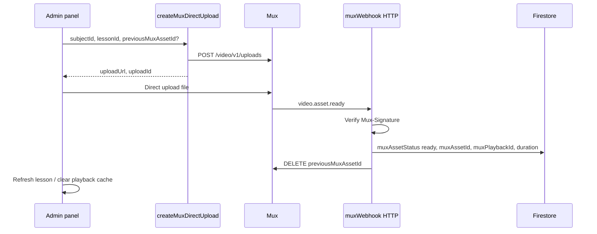

# Mux video upload, replace, and delete

Step-by-step guide for admin lesson video upload using **Mux Direct Upload**, an **HTTP Cloud Function webhook**, and the **Ardent Admin Panel**.

Related code today:

- Playback: `src/lib/mux-playback.ts` → `getMuxPlaybackUrl` (asia-south1)
- Lessons: `videos/{subjectId}/lessons/{lessonId}` — fields `muxAssetId`, `muxPlaybackId`, `muxAssetStatus`, `duration`
- UI placeholder: `src/components/videos/VideoLessonVideoUpload.tsx`

---

## Concepts

### “Update” a video

Mux does **not** replace the file inside an existing asset. **Update** means:

1. Upload a **new** asset
2. Save new IDs in **Firestore**
3. **Delete** the old Mux asset (after the new one is ready)

### Same title in Mux

Allowed. Titles are display-only. Uniqueness is the **Asset ID** (and **Playback ID**). Your app links lessons via Firestore `lessonId`, not the Mux title.

Use **passthrough** on upload for ops, e.g. `{"subjectId":"...","lessonId":"..."}`.

### Webhook → Cloud Function

Yes. Mux sends **HTTP POST** to an **HTTP Cloud Function** (`onRequest`). Use **Mux signature verification**, not Firebase Auth on the webhook.

Admin **starts** upload via a **callable** function (like `createStudent`), not via the webhook.

---

## Architecture



---

## Phase 0 — Prerequisites

1. **Mux account** with API access (Token ID + Secret) — server only, never in the admin app.
2. **Firebase project** `ardent-mds`, region **`asia-south1`**.
3. Access to the **Cloud Functions** repo (`getMuxPlaybackUrl`, `createStudent`, etc.).
4. **Admin panel** repo for UI wiring.
5. Decide **playback policy**: `public` or `signed` (must match `getMuxPlaybackUrl`).

---

## Phase 1 — Mux (dashboard)

6. Mux → **Settings** → **Access Tokens** → create token with permissions: create uploads, read assets, delete assets.
7. Store **Token ID** and **Secret** in GCP (Secret Manager or Functions env): `MUX_TOKEN_ID`, `MUX_TOKEN_SECRET`.
8. Mux → **Settings** → **Webhooks** → **Create webhook** (URL filled after deploy in step 18).
9. Enable events (minimum):
   - `video.asset.ready`
   - Recommended: `video.asset.errored`
10. Copy **Webhook signing secret** → `MUX_WEBHOOK_SECRET` in Functions env.

---

## Phase 2 — Backend: HTTP webhook function

11. Add **HTTP** function `muxWebhook`, region `asia-south1` (not callable).
12. Handler:
    - Read **raw body** (before JSON parse).
    - Verify **`Mux-Signature`** with `MUX_WEBHOOK_SECRET`.
    - Parse event `type` and `data`.
13. On **`video.asset.ready`**:
    - Parse **`passthrough`**: `subjectId`, `lessonId`, optional `previousMuxAssetId`.
    - Optionally `GET /video/v1/assets/{asset_id}` for full `playback_ids` and `duration`.
    - Update Firestore `videos/{subjectId}/lessons/{lessonId}`:
      - `muxAssetStatus: 'ready'`, `muxAssetId`, `muxPlaybackId`, `duration`, `updatedAt` (or `muxAssetStatus: 'errored'` + `muxAssetError`)
    - If `previousMuxAssetId` is set and ≠ new asset → `DELETE /video/v1/assets/{previousMuxAssetId}`
    - Return **200** quickly.
14. On **`video.asset.errored`** (optional): log; optionally set error state on lesson.
15. Make handler **idempotent** (same `muxAssetId` already on lesson → no-op).
16. Deploy: `firebase deploy --only functions:muxWebhook`
17. Copy deployed **HTTPS URL**.

---

## Phase 3 — Connect Mux webhook URL

18. Paste HTTPS URL into Mux → **Webhooks** → Save.
19. Send test event or run a real upload; confirm logs show verified requests.

---

## Phase 4 — Backend: create direct upload (callable)

20. Add callable `createMuxDirectUpload`, **admin-only** (same pattern as `createStudent`).
21. Input: `{ subjectId, lessonId, previousMuxAssetId?, corsOrigin }`. Admin panel sends `corsOrigin` as `window.location.origin`. Omit or leave empty `previousMuxAssetId` for **new** lessons; set to the current `muxAssetId` when **replacing** a video on edit.
22. Verify lesson exists (or support create-metadata-then-upload flow).
23. `POST https://api.mux.com/video/v1/uploads` with:
    - `cors_origin`: admin URLs (localhost + production)
    - `new_asset_settings.playback_policy`: e.g. `["public"]` or `["signed"]`
    - `new_asset_settings.passthrough`: JSON string, e.g.  
      `{"subjectId":"...","lessonId":"...","previousMuxAssetId":"..."}` (omit or empty when creating)
24. Return: `{ uploadUrl, uploadId }`.
25. Deploy: `firebase deploy --only functions:createMuxDirectUpload`

---

## Phase 5 — Backend: optional helpers

26. (Optional) Callable `deleteLessonMuxAsset`: delete `muxAssetId` in Mux; clear mux fields in Firestore.
27. (Optional) Callable `getMuxUploadStatus`: poll upload for dev.
28. **Firestore rules**: only backend/admin SDK should write `muxAssetId` / `muxPlaybackId` on lessons.

---

## Phase 6 — Admin panel: data layer

29. Extend `updateVideoLesson` or add `updateVideoLessonMux` if the client must patch mux fields (webhook usually writes them).
30. Add `src/lib/mux-video-upload.ts` — `httpsCallable` → `createMuxDirectUpload`.
31. Install `@mux/upchunk` (or Mux recommended uploader).
32. After upload: admin panel sets `muxAssetStatus: 'processing'`, then polls until webhook sets `ready` or `errored`.

---

## Phase 7 — Admin panel: UI

33. Wire `VideoLessonVideoUpload`: validate file → create upload → Upchunk → progress/errors.
34. **Edit**: `subjectId`, `lessonId`, `previousMuxAssetId: lesson.muxAssetId`.
35. **Add**: create lesson metadata first (empty mux fields) → upload with new `lessonId`.
36. On success: refresh list; clear playback cache (`subjectId:lessonId` in `mux-playback.ts`).
37. (Optional) Keep lesson inactive until `muxPlaybackId` exists.
38. (Optional) Run thumbnail generation after ready (`generateVideoLessonThumbnailFromMux`).

---

## Phase 8 — Environment variables

| Where | Variables |
|--------|-----------|
| Cloud Functions | `MUX_TOKEN_ID`, `MUX_TOKEN_SECRET`, `MUX_WEBHOOK_SECRET` |
| Admin `.env` | No Mux secrets; Firebase config only |

---

## Phase 9 — Test

41. Staging webhook URL or ngrok.
42. Upload small test MP4 from Edit Video Lesson.
43. Mux: asset status **Ready**.
44. Functions logs: webhook OK.
45. Firestore: `muxAssetStatus: 'ready'`, new `muxAssetId`, `muxPlaybackId`, `duration`.
46. Videos table: preview plays.
47. Replace again: old asset removed in Mux.
48. Failed/cancelled upload: previous video still works.

---

## Phase 10 — Production

49. Mux webhook → production `muxWebhook` URL.
50. `cors_origin` → production admin domain.
51. Deploy functions + hosting.
52. One real production upload; monitor errors and Mux asset count.

---

## Replace video (detailed)

| Step | Action |
|------|--------|
| 1 | Admin picks new file — **do not** delete old asset yet |
| 2 | Callable creates direct upload with `previousMuxAssetId` in passthrough |
| 3 | Browser uploads to Mux `uploadUrl` |
| 4 | Mux processes → **Ready** |
| 5 | Webhook updates Firestore with new IDs |
| 6 | Webhook deletes `previousMuxAssetId` in Mux |
| 7 | Admin refreshes; playback cache cleared |

---

## Delete video

### Replace cleanup (old asset only)

After Firestore points at the new asset:

```http
DELETE https://api.mux.com/video/v1/assets/{OLD_ASSET_ID}
```

Auth: `MUX_TOKEN_ID:MUX_TOKEN_SECRET` (server only).

### Remove video from lesson

1. Read `muxAssetId` from Firestore.
2. If non-empty → DELETE asset in Mux.
3. Clear Firestore: `muxAssetId`, `muxPlaybackId`, `duration` (and thumbnail if needed).
4. Clear admin playback cache.

### Manual delete in Mux dashboard

Allowed for ops, but **always sync Firestore** — otherwise lessons still reference a deleted asset.

---

## Mux API examples (curl)

**Delete asset**

```bash
curl -X DELETE "https://api.mux.com/video/v1/assets/YOUR_ASSET_ID" \
  -u "MUX_TOKEN_ID:MUX_TOKEN_SECRET"
```

**Get asset**

```bash
curl "https://api.mux.com/video/v1/assets/YOUR_ASSET_ID" \
  -u "MUX_TOKEN_ID:MUX_TOKEN_SECRET"
```

**Create direct upload**

```bash
curl -X POST "https://api.mux.com/video/v1/uploads" \
  -u "MUX_TOKEN_ID:MUX_TOKEN_SECRET" \
  -H "Content-Type: application/json" \
  -d '{
    "cors_origin": "https://your-admin-domain.com",
    "new_asset_settings": {
      "playback_policy": ["public"],
      "passthrough": "{\"subjectId\":\"SUBJECT_ID\",\"lessonId\":\"LESSON_ID\",\"previousMuxAssetId\":\"OPTIONAL_OLD_ID\"}"
    }
  }'
```

---

## Responsibility matrix

| Task | Owner |
|------|--------|
| Upload file bytes | Browser → Mux |
| Asset ready | Mux → HTTP `muxWebhook` |
| Save IDs | Webhook → Firestore |
| Delete old asset | Webhook (or helper) → Mux API |
| Start upload | Admin → callable `createMuxDirectUpload` |
| Play in table | Admin → `getMuxPlaybackUrl` |

---

## Minimum implementation order

1. Mux token + webhook secret  
2. Deploy `muxWebhook` → wire URL in Mux  
3. Deploy `createMuxDirectUpload`  
4. Wire admin upload UI + passthrough  
5. Test replace + delete old asset  
6. Production deploy  

---

## Open decisions (fill in when implementing)

- [ ] Playback policy: `public` / `signed`
- [ ] Max upload size and allowed MIME types
- [ ] Functions repo path and Firebase Functions gen (1 vs 2)
- [ ] Production admin `cors_origin` URL(s)
- [ ] Poll Firestore vs `getMuxUploadStatus` after upload
